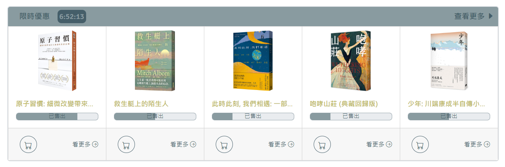

> # 小專主題 : 網路書店 -  Luke

* ### 發想動機 : 因為平時就喜歡看書，時常瀏覽相關網站，也因此想做一個自己理想中的網路書店的樣子。
* ### 網站架構 : 分為 首頁(index.html)、內容頁面(Member login)
* ### 開發技術 : 

1. HTML、CSS : 刻劃、美化版面

2. Bootstrap : RWD 響應式網頁

3. JavaScript : 
    1. 限時優惠 :  
     
    2. 彈出廣告 :  
      
    3. 商品切換 :  
     
    4. 數量增加減按鍵 :  
    

